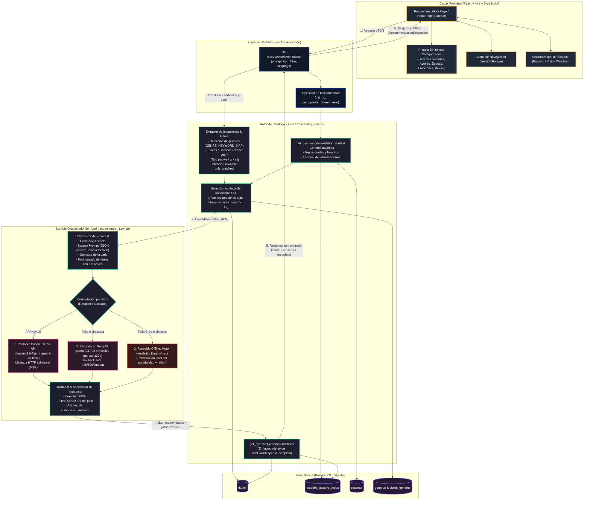

# Arquitectura del Recomendador Mínimo — CineTrack

Este documento detalla la arquitectura, flujo de datos, cascada de resiliencia y mecanismos de *grounding* del **Recomendador Mínimo por IA** de CineTrack, implementado en el branch `feature/recomendador-minimo`.

---

## 1. Diagrama de Arquitectura y Flujo de Datos

El archivo fuente `.mmd` independiente se encuentra en [docs/UML/recomendador/arquitectura_recomendador_minimo.mmd](docs/UML/recomendador/arquitectura_recomendador_minimo.mmd).

---

## 2. Principios de Diseño

### 2.1. Grounding Estricto sobre el Catálogo Local (Anti-Alucinación)
El LLM no opera en un espacio abierto sin restricciones; opera sobre un **pool cerrado de candidatos** preseleccionado en la base de datos relacional:
1. `catalog_service.get_recommendation_candidates` extrae de 30 a 45 títulos relevantes según filtros de género, época (`extract('year', Titulo.fecha_estreno)`), tipo de obra y popularidad (`vote_count >= 50`).
2. Se inyecta al modelo únicamente el ID, título, tipo, año, géneros, puntaje de comunidad, sinopsis corta y fragmento de reseña comunitaria de esos candidatos.
3. El *System Prompt* y la capa de sanitización posterior (`sanitized_recs`) garantizan que el modelo solo pueda sugerir obras que figuren con su `title_id` en dicho pool.

### 2.2. Cascada de Resiliencia Multinivel (Offline-First Ready)
Para evitar que el usuario quede desatendido ante cortes de cuota o límites de tasa de los proveedores de nube:
- **Nivel 1 (Primario):** Google Gemini API (`gemini-2.0-flash` o configurable vía `GEMINI_MODEL`).
- **Nivel 2 (Secundario):** Groq API (`llama-3.3-70b-versatile` o `openai/gpt-oss-120b`). Se activa automáticamente ante códigos HTTP 429, 500, timeouts o excepciones de red.
- **Nivel 3 (Heurístico Local):** Motor determinista en Python sin dependencias de red. Si no hay API keys configuradas o ambas APIs fallan, puntúa los candidatos por afinidad de géneros y calificación unificada, devolviendo siempre una recomendación válida.

### 2.3. Sincronización Estricta de Idioma
- El frontend transmite explícitamente el idioma actual de la interfaz (`language: "es" | "en"`).
- Tanto el prompt de sistema como el prompt de usuario imponen la directiva crítica en mayúsculas para asegurar que el mensaje de apertura y cada una de las justificaciones (`reason`) se redacten en el idioma solicitado, independientemente de si el texto de búsqueda contiene nombres propios o títulos en inglés.
- El motor heurístico local implementa plantillas bilingües equivalentes.

### 2.4. Experiencia de Usuario y Persistencia
- **Caché de sesión (`sessionStorage`):** Al navegar hacia la ficha de detalle de un título recomendado y retroceder con el navegador, las recomendaciones y el prompt previo se conservan intactos sin forzar un nuevo llamado a la API.
- **Sincronización bidireccional:** Al alternar el estado de un título (favorito, visto, watchlist) desde la card o desde la página de detalle, el estado visual de la tarjeta recomendada se actualiza en tiempo real.
- **Diferenciación visual clara:** Cada tarjeta recomendada cuenta con badges explícitos de `Película` o `Serie de TV` y la justificación personalizada redactada por el asistente.
